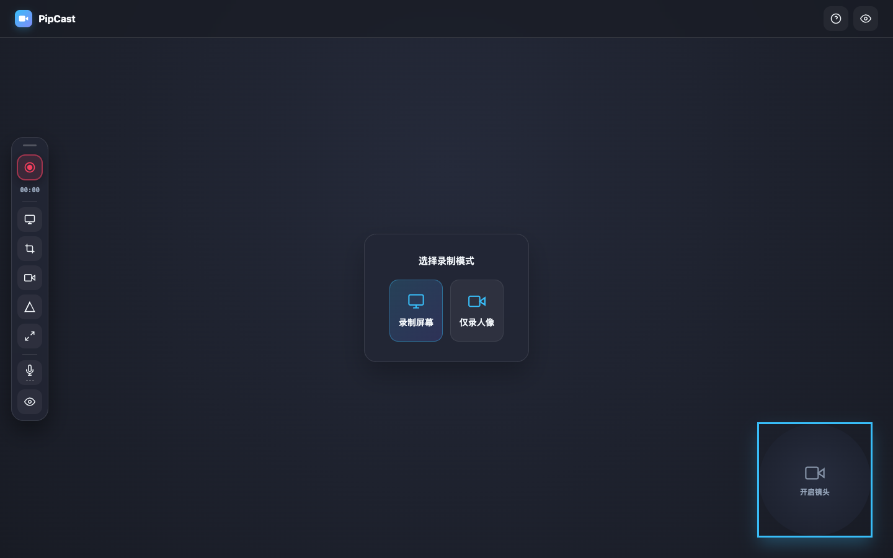
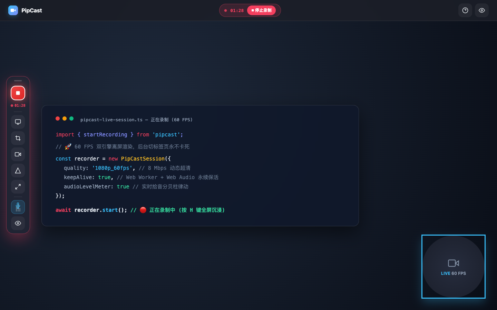
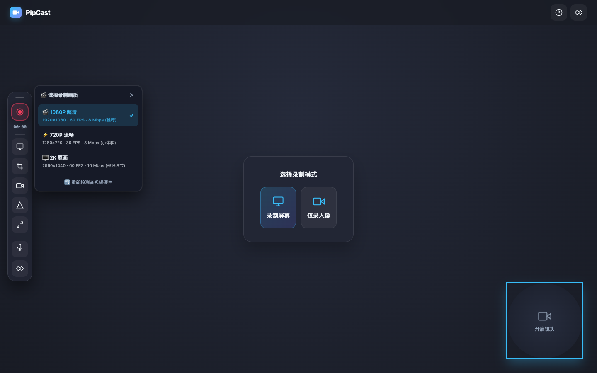
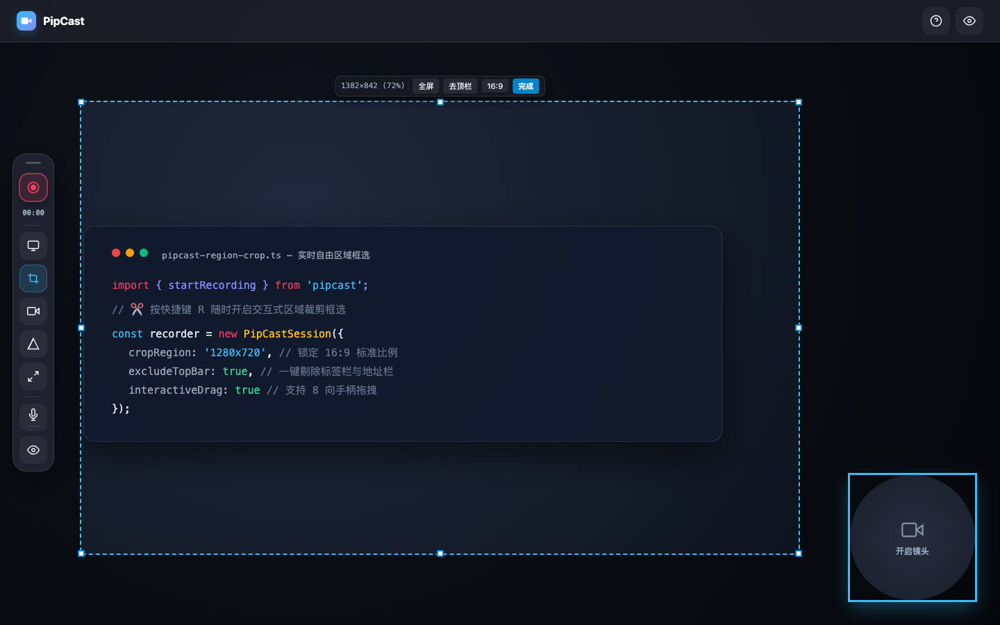
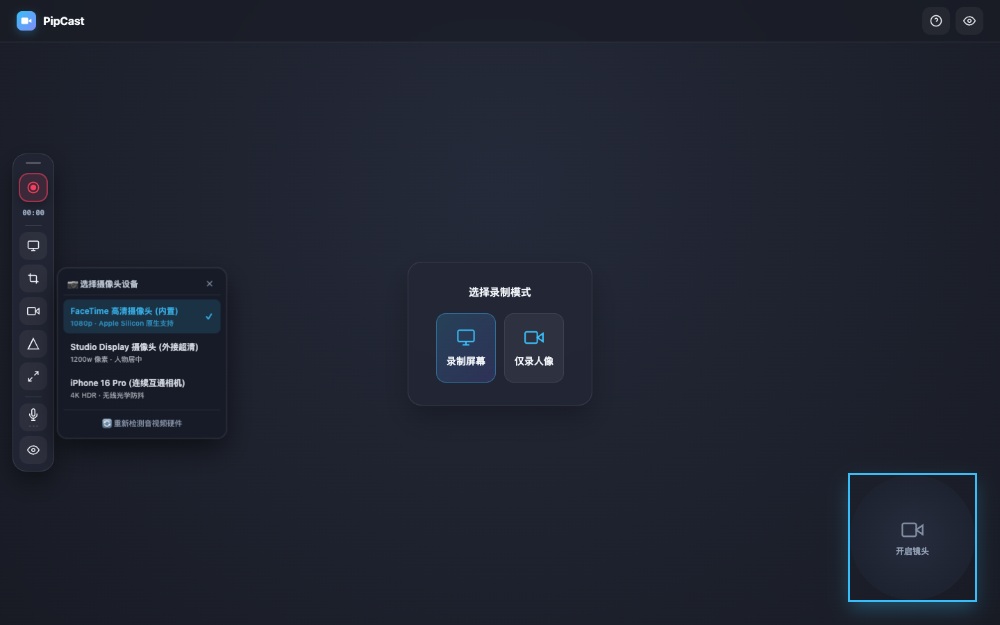

# 🎥 PipCast

> **Free-shape floating webcam bubble meets frictionless in-browser 60 FPS screen recorder.**  
> **100% Cross-Platform (macOS · Windows · Linux · ChromeOS)** · An open-source, zero-install, 100% offline alternative to Loom. Record your screen, your floating facecam, and crystal-clear audio with a single click.

[](LICENSE)
[](#)
[](#)
[](#)
[](#)
[](#)
[](#)
[](README_CN.md)

[🇨🇳 简体中文文档](README_CN.md) | **English Documentation**

---



---

## 💡 Why PipCast?

Recording presentations, tutorials, bug walk-throughs, and software demos shouldn't require bloated software, monthly subscription fees, or cloud privacy risks:

| Dimension | ☁️ Loom / Cloud Apps | 🎙️ OBS Studio | 🍏 QuickTime / Native | ⚡ **PipCast** |
| :--- | :--- | :--- | :--- | :--- |
| **Cross-Platform** | Requires extension / Electron app | Heavy OS-specific installers | macOS only (QuickTime) | **🌐 100% Universal: macOS, Windows, Linux, ChromeOS** |
| **Camera Shapes** | Rigid circle or square | Complex manual alpha masks | Rigid rectangular window | **Circle, Squircle (28%), Rounded, Hexagon, Oval** |
| **Installation** | Heavy extension or electron app | Multi-GB install & complex scene setup | Preinstalled, but no facecam compositing | **0 Install: Pure single-file browser app** |
| **Background Tab Recording** | Often throttles in browser extensions | Background-native | N/A | **Dual-Engine Worker: Solid 60 FPS, never freezes** |
| **Cost & Limits** | 5-minute cap, $12.50/mo subscription | Free & Open Source | Free | **100% Free & Open Source, Unlimited duration** |
| **Privacy & Security** | Uploads raw video to third-party cloud | 100% Local | 100% Local | **100% In-Browser & Local-First (0 bytes leaked)** |
| **Audio Capture** | Requires audio extension drivers | Requires virtual audio cables | Can't mix tab audio easily | **Automatic Web Audio Mixer (Mic + System/Tab)** |
| **Dock & Region Crop** | Fixed controls | Manual scene coordinates | Entire screen / static box | **4-Way Magnetic Snapping Dock + 8-Handle Crop** |
| **Speed to Record** | 20–40 seconds loading | 1–3 minutes setup | 30 seconds | **⚡ Ready in 2 seconds** |

---

## 📸 Screenshots Showcase

### 🔴 Active 60 FPS Recording with Live Presentation
Crisp 60 FPS dual-engine compositing, floating facecam bubble, jumping audio meters, pulsating crimson recording pill, and clean timecode tracking:


<br/>

### 🎬 Quality Presets (1080P 60FPS / 720P 30FPS / 2K 60FPS)
Right-click on the Record button to instantly switch bitrate and resolution on the fly:


<br/>

### ✂️ Interactive Region & Tab Crop Capture (`R` Key)
Select exact recording coordinates with 8 drag handles, real-time pixel dimension readouts, and one-click presets to remove browser tabs or lock standard 16:9:


<br/>

### 🎛️ Multi-Device Camera & Microphone Hot Switcher
Seamlessly swap between built-in webcams, studio displays, USB mics, and wireless **iPhone Continuity Camera**:


---

## ✨ Features Breakdown

### 🔮 1. Free-Shape Floating Webcam (FaceCam)
- **5 Geometric Shapes**: Instantly cycle through **Circle**, **Apple Squircle (28% superellipse)**, **Rounded Rectangle**, **Cyber Hexagon**, and **Wide Oval**.
- **Free Drag & Boundary Snapping**: Freely position your camera bubble anywhere across the screen.
- **Scroll & Corner Resize**: Hover over the bubble and scroll your mouse wheel or drag diagonal handles to scale between 100px and 360px.
- **Multi-Device & Continuity Camera**: Native support for Apple Silicon FaceTime HD cameras, external USB webcams, and wireless **iPhone Continuity Camera** (4K HDR).
- **Glow Borders & Mirroring**: Cyan Glow, Cyber Purple, Emerald Stealth, or Borderless; flip camera horizontally (`🪞`) with one click.

### ⚡ 2. 60 FPS Dual-Engine Background Render Loop
- **Zero Background Freezing**: Browsers aggressively throttle background tabs, reducing `requestAnimationFrame` to 0 FPS and causing recordings of other tabs to look like frozen screenshots.
- **The PipCast Solution**: Combines an unthrottled **Web Worker interval timer (16.6ms)** with an inaudible **Web Audio keep-alive oscillator (`gain: 0.00001`)**, completely exempting the tab from Chrome background process suspension. Recordings remain silky smooth at 60 FPS even when you switch tabs or minimize the window!

### 🌐 3. Truly 100% Cross-Platform & Hardware Agnostic
- **Run Anywhere with a Modern Browser**: Built strictly on W3C standard Web APIs (`getDisplayMedia`, `getUserMedia`, `<canvas>`, Web Audio, Web Worker, MediaRecorder). Zero OS-specific native binaries, drivers, or kernel extensions required!
- **🍏 macOS**: Native support for Apple Silicon (M1–M4) & Intel, FaceTime HD cameras, studio displays, and wireless **iPhone Continuity Camera**.
- **🪟 Windows 10 & 11**: DirectShow webcams, WASAPI audio mixing, high-DPI display scaling, and multi-monitor screen picker out of the box (with 1-click `scripts\start.bat`).
- **🐧 Linux (Ubuntu, Fedora, Arch, Debian)**: Wayland & X11 screen and audio capture via Desktop Portal (PipeWire / PulseAudio) and V4L2 webcams with zero ALSA configuration headaches (with `scripts/start.sh`).
- **💻 ChromeOS & Lightweight Laptops**: Ultra-low CPU and memory footprints. Runs buttery smooth even on Chromebooks and older hardware.

### 🧲 4. 4-Way Magnetic Dock Snapping
- **Proximity Magnetism**: Drag the floating control Dock near any screen edge (Left, Right, Top, Bottom) to trigger an elastic snap animation with glowing magnetic guides.
- **Responsive Layout Switching**: Automatically adapts between vertical pill and horizontal bar layouts based on edge orientation.

### 🎬 5. Recording Quality Presets
- **1080P Super HD (Default)**: 1920×1080 · 60 FPS · 8 Mbps (recommended for coding, demos, and presentations).
- **720P Smooth**: 1280×720 · 30 FPS · 3 Mbps (compact file sizes, fast exports).
- **2K Studio Master**: 2560×1440 · 60 FPS · 16 Mbps (maximum fidelity for high-DPI Retina displays).

### ✂️ 6. Interactive Region & Tab Crop Capture (`R` Key)
- **8-Handle Bounding Box**: Drag corners and edges to isolate exact window areas.
- **Remove Tab Bar**: One-click preset crops out the browser's top tabs and URL navigation bar.
- **16:9 Aspect Ratio Lock**: Instantly conform any cropped region to YouTube/Bilibili presentation standards.

### 🎙️ 7. Live Audio Level Visualizer & Mixer
- **Real-Time LED Meter**: Web Audio API audio analyzer with 3-bar jumping sound waves. You will never accidentally record a presentation on mute again.
- **Hardware Switcher**: Right-click on the microphone icon to hot-swap inputs (built-in mic, AirPods, USB audio interfaces).
- **System Audio Mixing**: Seamlessly mix microphone voiceover with system or browser tab audio.

### 🎬 8. Clean Presentation Mode (`H` Key)
- Press **`H`** at any moment to hide all docks, toolbars, and header menus, leaving only your presentation content and floating facecam.

---

## 🌐 Platform & Browser Compatibility

| Browser | Windows 10 / 11 | macOS (Intel / M-Series) | Linux (X11 / Wayland) | ChromeOS |
| :--- | :---: | :---: | :---: | :---: |
| **Google Chrome** | ✅ 60 FPS Full Support | ✅ 60 FPS Full Support | ✅ 60 FPS Full Support | ✅ 60 FPS Full Support |
| **Microsoft Edge** | ✅ 60 FPS Full Support | ✅ 60 FPS Full Support | ✅ 60 FPS Full Support | — |
| **Brave / Vivaldi / Opera** | ✅ Full Support | ✅ Full Support | ✅ Full Support | — |
| **Apple Safari** | — | ✅ Supported (16.4+) | — | — |
| **Mozilla Firefox** | ✅ Supported | ✅ Supported | ✅ Supported | — |

---

## ⌨️ Keyboard Shortcuts Reference

| Shortcut | Action | Description |
| :---: | :--- | :--- |
| **`Space`** | **Start / Stop Recording** | Trigger 3-second countdown or stop current recording |
| **`R`** | **Crop Region Capture** | Toggle interactive bounding box and tab crop toolbar |
| **`H`** | **Toggle Clean View** | Hide or restore all UI toolbars and docks |
| **`S`** | **Cycle Camera Shape** | Circle $\rightarrow$ Squircle $\rightarrow$ Rounded $\rightarrow$ Hexagon $\rightarrow$ Oval |
| **`C`** | **Toggle Camera** | Turn floating facecam ON or OFF (**Right-click to switch device**) |
| **`M`** | **Toggle Microphone** | Mute or unmute mic voiceover (**Right-click to switch device**) |
| **`Esc`** | **Cancel / Dismiss** | Cancel countdown, exit crop mode, or close preview modals |
| **Scroll / Handles** | **Resize Bubble** | Hover and scroll mouse wheel or drag diagonal handles |

---

## 🚀 Quick Start by Operating System

PipCast has **zero build steps, zero node_modules, and zero dependencies**.

### 🍏 macOS (Intel & Apple Silicon)
Double-click **`start.command`** in the project root.
- Starts a zero-overhead local studio server on `http://localhost:8000`.
- Grants 100% full macOS hardware camera and screen capture entitlements.

### 🪟 Windows (10 & 11)
Double-click **`scripts\start.bat`** (or execute in PowerShell / CMD).
- Automatically detects Python or Node and launches your default browser at `http://localhost:8000`.

### 🐧 Linux (Ubuntu, Fedora, Arch, Debian)
Run the launcher script from terminal:
```bash
chmod +x ./scripts/start.sh
./scripts/start.sh
```

### 🌐 Universal CLI (Any OS with Python or Node)
```bash
# Using Python
python3 -m http.server 8000

# Or using Node
npx serve -l 8000 .
```

### 📂 Direct File Opening
Open **`index.html`** directly in Chrome, Edge, or Safari.  
*(Note: Chromium security policies require `http://localhost:8000` to enable microphone capture; screen recording and camera work out of the box on `file://`).*

---

## 📁 Repository Structure

```
pipcast/
├── index.html              # Core standalone single-file web application
├── start.command           # 1-click launcher for macOS desktop
├── package.json            # Open-source package metadata & scripts
├── LICENSE                 # MIT License
├── README.md               # English Documentation
├── README_CN.md            # Chinese Documentation
├── scripts/
│   ├── start.sh            # Linux / macOS shell launcher
│   ├── start.bat           # Windows launcher
│   └── diagnostics.html    # Raw WebRTC hardware diagnostic utility
└── docs/
    ├── hero_preview.png    # High-resolution hero studio UI screenshot
    ├── recording_active.png# Active recording session screenshot
    ├── quality_menu.png    # Quality preset switcher screenshot
    ├── crop_capture.png    # Region & tab crop mode screenshot
    ├── device_menu.png     # Hardware device switcher screenshot
    ├── HARDWARE_GUIDE.md   # Continuity Camera & Clamshell technical guide
    └── TROUBLESHOOTING.md  # Permissions, Audio mixing & TCC resolution guide
```

---

## 🔒 Privacy & Local-First Philosophy

PipCast is built on a **100% local-first principle**:
- **0 Bytes Transferred**: All video compositing, canvas clipping, and audio mixing happen inside your browser's V8 / WebAssembly engine.
- **No Analytics / Telemetry**: No third-party trackers, cookies, or remote scripts.
- **Air-Gapped Ready**: You can unplug your Wi-Fi, run PipCast, and record offline with complete functionality.

---

## 📄 License

MIT License © 2026 PipCast Contributors. Free to use, modify, and distribute.
